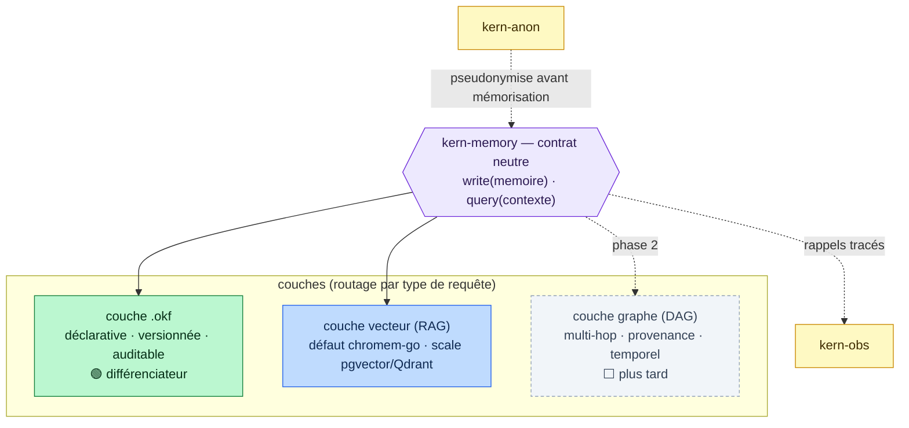

# kern-memory — état de l'art des technos matures

> Objectif : éclairer la **direction** de la brique `kern-memory` (mémoire agnostique :
> `.okf` · RAG · DAG) avec l'état de l'art 2026, avant d'ouvrir l'épic (cf. ROADMAP EPIC-13).
> Analyse, ne décide rien. — 2026-07-22.

## 1. Le consensus 2026 : mémoire **hybride**, routée

Aucune architecture unique ne gagne. Les agents en production combinent 2–3 approches et
**routent** chaque requête vers le store adapté :

| Approche | Forte sur | Faible sur | Coût |
|---|---|---|---|
| **Vecteur (RAG)** | rappel sémantique large, factoïde single-hop, fraîcheur | raisonnement multi-hop, vue globale | faible latence |
| **Graphe (GraphRAG / KG)** | multi-hop, sensemaking global, **provenance**, temporel | single-hop (−13 %), entités périmées (−16 % sur time-sensitive) | ~2,3× latence |
| **Mémoire « OS » (paging)** | agents longue durée, gestion active du contexte | complexité, dépendance LLM pour paginer | variable |

→ **Direction : hybride par couches, activées progressivement.** Ne pas tout faire d'un coup.

## 2. Frameworks mémoire — lecture souveraineté

| Framework | Licence | Self-host | Modèle | Fit souverain |
|---|---|---|---|---|
| **Cognee** | Apache-2.0 | ✅ total, rien de gated | graph + RAG, local-first, extraction auto | 🟢 excellent |
| **Letta** (ex-MemGPT) | Apache-2.0 | ✅ | mémoire « OS » (main/recall/archival), paging par function calls | 🟢 bon |
| **Hindsight** | MIT | ✅ | vecteur + graphe | 🟢 bon |
| **Graphiti** (moteur de Zep) | OSS | ✅ (moteur) | **temporal knowledge graph** (le meilleur sur le temporel) | 🟡 réf. à étudier |
| **Zep** (plateforme) | propriétaire | ❌ **cloud-only** (Community retirée en 2025) | temporal KG managé | 🔴 anti-souverain |
| **Mem0** | core OSS + managé | 🟡 | 3 niveaux (user/session/agent), store hybride | 🟡 dépend de l'offre |

**À retenir** : s'inspirer de **Graphiti** (temporel) sans dépendre de **Zep** ; **Cognee /
Letta / Hindsight** sont les références self-host/sovereign-friendly. Aucun n'est Go-natif.

## 3. Vector stores self-host

| Store | Sweet spot | Ops | Note souverain |
|---|---|---|---|
| **chromem-go** | in-process, léger, embarqué | **zéro service** (dans le binaire Go) | 🟢 colle au single-binary |
| **pgvector** | < 50M vecteurs, déjà sous Postgres | 1 base (embeddings+docs+meta, SQL joins) | 🟢 simple, souverain |
| **Qdrant** | 1M–100M+, throughput max | 1 conteneur Docker ~100 Mo (Rust) | 🟢 le plus rapide |
| **Weaviate** | hybrid search, isolation multi-tenant | modéré | 🟢 |
| **Milvus** | milliard-scale | lourd (k8s + etcd + MinIO) | 🟡 surdimensionné pour nous |

## 4. Écosystème Go (plus mince, mais réel)

- **chromem-go** — vector DB embarquable, zéro dépendance, in-memory + persistance optionnelle
  (interface façon Chroma). Idéal pour un **tier par défaut sans service externe**.
- **GoRag** (StacklokLabs) — interface Go RAG + embeddings sur **pgvector** et **Qdrant**.
- **qdrant/go-client**, clients Postgres/pgvector standard.
- **Graphe/DAG en Go** : peu mature. Options : Neo4j (driver Go), ou graphe léger sur
  Postgres/SQLite, ou **Graphiti en subprocess** (comme kern-link) si on veut son temporel.

## 5. La spécificité qui nous sert : `.okf`

`.okf` = **mémoire déclarative, structurée, versionnable** (dans l'esprit des fiches OKF déjà
utilisées dans ce repo). C'est un **différenciateur souverain** : mémoire **relisible, auditable,
diff-able en git**, à côté du vecteur (opaque) et du graphe. Proche de l'« archival store » de
Letta, mais **fichier + versionné** plutôt que boîte noire — précieux pour la conformité (audit
trail, cf. positionnement régulé).

## ✅ Décision (brainstorm 2026-07-22)

Tranché : **kern-memory 100 % Go natif** (ni Cognee ni Graphiti adoptés — cohérence
single-binary/souverain), store vecteur par défaut **chromem-go** (pgvector/Qdrant en option
scale via le même contrat), **graphe/DAG léger en Go dès la phase 1** (sur SQLite/Postgres),
**embeddings pluggables via env** (défaut modèle local self-host). Détails de mise en œuvre et
découpage : ROADMAP **EPIC-13**. La section ci-dessous reste l'analyse ayant mené à ce choix.

## 6. Direction proposée pour kern-memory (analyse ayant mené à la décision)

Brique **agnostique**, contrat neutre `query/write`, backends **pluggables via env** (comme
kern-link / kern-obs). On **n'écrit pas** d'embeddings ni de vector DB — on compose.

**Staging suggéré (make-vs-adopt) :**
1. **Phase 1 — `.okf` + vecteur** : couche `.okf` (maison, notre valeur) + vecteur via
   **chromem-go** par défaut (embarqué, souverain, zéro ops), **pgvector/Qdrant** en option scale
   (adopter, pas réécrire). Rappel sémantique + mémoire déclarative auditable.
2. **Phase 2 — graphe/DAG** : ajouter multi-hop/provenance. S'inspirer de **Graphiti** (temporel) ;
   décider make (graphe léger Go sur Postgres) vs adopt (Graphiti en subprocess). **À trancher.**
3. **Transverses** : intégration **kern-anon** (mémoriser du pseudonymisé) et **kern-obs**
   (traçabilité des rappels) dès la phase 1.

**Ce qu'on n'adopte pas** : Zep (cloud-only, anti-souverain), Milvus (surdimensionné).

## 7. Questions ouvertes pour le brainstorm (→ EPIC-13)

- Format `.okf` : schéma, granularité, indexation, lien avec les fiches OKF existantes.
- Store vecteur par défaut : chromem-go (embarqué) confirmé ? seuil de bascule vers pgvector/Qdrant ?
- Graphe : couplé au graphe d'exécution kern-orch (sous-graphes) ou store séparé ? make vs adopt Graphiti ?
- Portée : court terme (state/checkpoints, déjà là) vs long terme (cross-run/cross-agent) — frontière ?
- Contrat d'API neutre : forme exacte de `query`/`write`, réintégration dans le state/prompt.
- Embeddings : quel modèle souverain/self-host (pas d'appel cloud imposé) ?

## Sources
- [Best AI agent memory frameworks 2026 — Atlan](https://atlan.com/know/best-ai-agent-memory-frameworks-2026/)
- [Agent memory frameworks tested: Mem0 vs Zep vs Letta vs Cognee — Particula](https://particula.tech/blog/agent-memory-frameworks-tested-mem0-zep-letta-cognee-2026)
- [Best open-source agent memory frameworks 2026 — EverMind](https://evermind.ai/blogs/best-open-source-agent-memory-frameworks-2026)
- [Graph RAG vs Vector RAG for agent memory 2026 — AgentMarketCap](https://agentmarketcap.ai/blog/2026/04/07/graph-rag-vs-vector-rag-agent-memory-neo4j-pgvector)
- [Vector DB vs Knowledge Graph for agent memory — Atlan](https://atlan.com/know/vector-database-vs-knowledge-graph-agent-memory/)
- [Vector DBs vs Graph RAG, when to use which — MachineLearningMastery](https://machinelearningmastery.com/vector-databases-vs-graph-rag-for-agent-memory-when-to-use-which/)
- [Best self-hosted vector database 2026 — RankSquire](https://ranksquire.com/2026/02/27/best-self-hosted-vector-database-2026/)
- [Vector databases compared 2026 (pgvector/Qdrant/…) — Layerbase](https://layerbase.com/blog/vector-databases-compared-2026)
- [GoRag — Go interface for augmented LLM retrieval (GitHub)](https://github.com/StacklokLabs/gorag)
- [chromem-go — embeddable vector DB for Go (GitHub)](https://github.com/philippgille/chromem-go)
